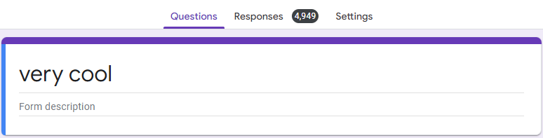

# Google Forms Spammer

Pretty fast multi-threaded, command-line driven google form spammer.

### Features
- Choose which option to spam (MCQ and Checkbox)
- Choose what answer to spam (Short and Long Answer Questions)
- Choose how many times to spam
- Bypasses [xFanatical's Anti-Spamming for Google Forms](https://xfanatical.com/blog/captcha-for-forms/)
- Multi-threaded, meaning that responses can be sent relatively quickily
- 85%-90% of requests pass through

### Quickstart
- Download the windows executable through the [releases](https://github.com/UnidentifiedX/Google-Forms-Spammer/releases) tab. Or, you can download the source code and run it through the python command line
- Follow the step-by-step instructions that will guide you through the whole process
- No coding experience required!

### Limitations
- Cannot answer Google Forms that collect emails
- If the xFanatical CAPTCHA time runs out, you have to re-key everything (this may be patched in the future)
- Cannot answer forms with multiple pages
- Currently cannot answer forms with `<span>`s that are not questions (including images)
- **Important: Please enter the long version of the form link, i.e. it starts with `https://docs.google.com/forms` rather than `https://forms.gle`**

**Also very important: Use at your own risk. I do not encourage nor endorse any kind of activity that is illegal, causes harm to others, or is morally wrong.**

 

What happens after 5000 responses

### TODO
- Add a proxy so we won't get 429 responses in large-volume request environments like schools
- Basically reduce all the limitations

## How this works

### Getting the questions
First, we start by creating a `driver` to load the Google Form. This allows JavaScript-reliant parts of HTML to be loaded for scraping.

We then use [BeautifulSoup](https://www.crummy.com/software/BeautifulSoup/bs4/doc/) to help us parse the html to allow us to search by html tags, attibutes and class names.

```py
driver = webdriver.Chrome(ChromeDriverManager().install())
response = driver.get(url)  

src = driver.page_source
soup = BeautifulSoup(src, 'html.parser')
driver.quit()
```

Now, we start to identify questions by identifying which tags mark a question. We start to realise that the

```html
<div class="" role="listitem">

</div>
```

tags denote the start of a question. However, there is a special case where `role="listitem"` also appears in checkbox questions. Hence, we have to filter them out by using an actual question's properties: it only has two attribues in the `<div>` tag, rather than a checkbox's five.

```py
questions = soup.find_all(lambda div: div.name == "div" and len(div.attrs) == 2, {"role": "listitem"})
```

We then loop through each question. We first create a local `_soup` that parses that question's HTML. The question positions are located by finding the first `<span>` tag within the question, and is always there regardless of the question type.

First, we initialize the different properties of a question.

```py
for id in questions:
    _question = _soup.find("span", {}).contents[0]
    _required = False
    _options = []
    _id = None
    _type = None

    # Other code goes here
```

Unfortunately, there is no straightforward way to tell the question type (that I know of). Hence, we have to run a try-catch (try-except) statement. The point is that due to different question types having different data structures, we will encounter an error when trying to find a HTML tag or attribute that is not there. Hence, we will fall to the `except` clause. I will explain every question type below.

**MCQ Questions**

The first `<input>` tag has an attribute `name` that contains the id of the question, with `"_sentinel"` added behind the id (I don't know the reason. Please enlighten me.). Then, to figure out whether a question is required, we find a `<span>` that has the `aria-label="Required question"`. Whether if it can be found is whether the question is required. To distunguish between an MCQ and a Checkbox question can be summarised in the table below:

| Clear Selection Option | `<div>Required</div>` Tag Present | Question Type |
| :--------------------: | :-------------------:             | :-----------: |
| Yes                    | Yes                               | Not Possible  |
| Yes                    | No                                | MCQ           |
| No                     | Yes                               | Checkbox      |
| No                     | No                                | Open-Ended    |

**Note: The `<div>Required</div>` is not the same as `<span aria-label="Required question"></span>`. The prior is a tag unique to Checkbox questions.**

We throw an exception when it is not the question type, to fall to the `except` clause.

```py
_id = _soup.find("input").attrs["name"].replace("_sentinel", "")
all_spans = _soup.find_all("span")
required_question = _soup.find("span", {"aria-label": "Required question"})

if all_spans[-1].contents[0] != "Clear selection" and _soup.find_all("div")[-2].contents[0] == "Required":
    raise Exception("Should not be an MCQ")
```

The options for MCQ questions are hidden within `<span>`s. Hence, we can get all the `<spans>`, minus the question `<span>` and other irrelevant `<span>`s and extrapolate the questions.

```py
if required_question != None:
    _required = True

    spans = all_spans[1:]
    for i in range(len(spans) - 2): 
        _options.append(spans[i + 2].contents[0])
else:
    spans = all_spans[1:-1]
    for i in range(len(spans) - 2): 
        _options.append(spans[i + 1].contents[0])

_type = "Multiple Choice"
```

**Checkbox Questions**

They work similar to MCQ questions. That's literally it.

```py
_id = _soup.find("input", {"type": "hidden"}).attrs['name'].replace("_sentinel", "")
required_question = _soup.find("span", {"aria-label": "Required question"})
all_spans = _soup.find_all("span")

if required_question != None:
    _required = True

    spans = all_spans[1:]
    for i in range(len(spans) - 1): 
        _options.append(spans[i + 1].contents[0])
else:
    spans = all_spans[1:]
    for i in range(len(spans)): 
        _options.append(spans[i].contents[0])

_type = "Checkbox"
```

**Open-Ended Questions**

To find the id of an open-ended question is a little harder. It is located withinan (incomplete) array in a `<div>` with a `data-params` tag. Since we can't parse the array, we have to split the string by the `[` character. We have to manually find the position of the id, then append `"entry."` to the front.

```py
_id = "entry." + _soup.find(lambda div: div.name == "div" and "data-params" in div.attrs, {}).attrs['data-params'].split('[')[3].replace(",", "")

if _soup.find("span", {"aria-label": "Required question"}) != None:
    _required = True

_type = "Open Ended"
```

We then add the data to a global dictionary, with the question id as keys.

```py
question_dictionary[_id] = {
    "Question": _question,
    "Type": _type,
    "Options": _options,
    "Required": _required
}
```

### Getting the answers
We loop through the `question_dictionary` and based on the question type, ask certain questions and get certain answers. We add the answer into a global dictionary, with the key as the id and value as the answer.

```py
answers[_id] = answer
```

### Sending the requests
I've found that splitting the requests into sets of 10 is a good balance between speed and reliability. Hence, we create a thread array, then load the threads in. We have a function called `do_request` that does POST requests to the Google Forms endpoint, which is in the format of `https://docs.google.com/forms/u/0/d/e/FORMID/formResponse`. Then, we start each thread and we're done.

```py
successful_requests = 0
def do_request(times: int, url, data):
    global successful_requests
    for i in range(times):
        response = requests.post(url, data=data)
        if response.status_code == 200:
            successful_requests += 1

# Other code

new_url = url.split("/viewform")[0].replace("/d/e", "/u/0/d/e") + "/formResponse"
start = time.time()
thread_count = int(times/10)
threads = []
for i in range(thread_count - 1):
    t = threading.Thread(target=do_request, args=(10, new_url, answers,))
    t.daemon = True
    threads.append(t)

t = threading.Thread(target=do_request, args=(times % 10, new_url, answers,))
t.daemon = True
threads.append(t)

for i in range(len(threads)):
    print(f"Starting thread {i}")
    threads[i].start()
        
for i in range(len(threads)):
    threads[i].join()

end = time.time()
print(ConsoleColor.OKGREEN + f"Complete! Sent {times} requests, ({successful_requests} successful, {times - successful_requests} unsuccessful) in {end - start} seconds.")
successful_requests = 0
```